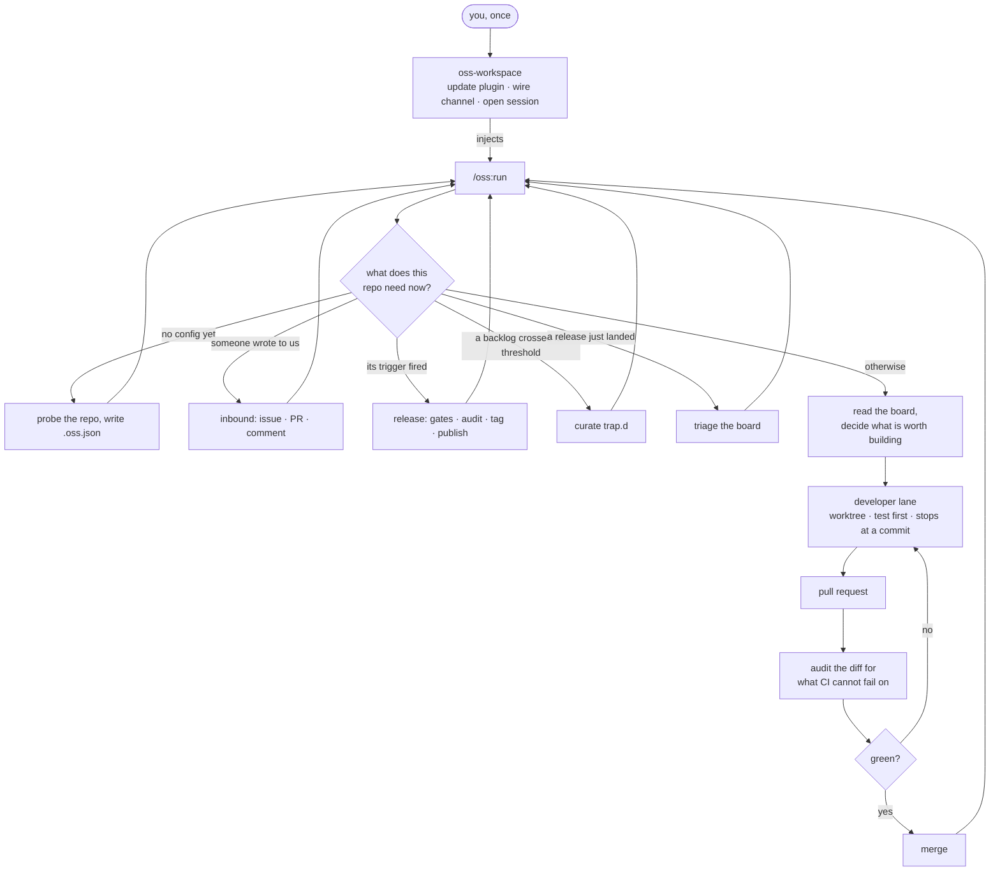

# claude-oss

Runs an open-source repo as its maintainer: triage the tracker, delegate the work, review hard,
merge on green.


[](https://github.com/Digital-Process-Tools/claude-oss/actions/workflows/tests.yml)


## Install

```
/plugin marketplace add Digital-Process-Tools/claude-marketplace
/plugin install oss@dpt-plugins
```

**Then run `/reload-plugins`, or restart Claude Code.** Plugin registrations are read once at
session start, so a mid-session install leaves the agent registry unresolved until you do.

See [docs/install.md](docs/install.md) for developing this plugin's own source, and for setting
up `oss-workspace` in a repo you maintain.

## Type it once

`/oss:run` is what a session opens on, and the only thing a person types. It asks one
question — what does this repo need now — and answers it from state and config, never
from an argument. Everything repo-specific lives in `.oss.json`: a cadence step written
only in prose is one somebody has to remember, which is why they are thresholds instead.



The loop arms its own next turn and stops only on a direct instruction to stop.

## The launcher

Once installed and set up in a repo you maintain, `/oss:doctor` prints the exact, paste-ready
command to wire up `oss-workspace` for the version you have installed. Run it from that repo, and
`oss-workspace` opens a session there with the maintainer loop already running.

## More

- [docs/overview.md](docs/overview.md) — what it is for, and how to tell if work is inside that.
- [docs/install.md](docs/install.md) — installing, developing it, the launcher and its symlink.
- [docs/commands.md](docs/commands.md) — every slash command.
- [docs/status-line.md](docs/status-line.md) — every status-line field.
- [docs/development.md](docs/development.md) — the test suite and this repo's own guards.
- [docs/status.md](docs/status.md) — what installing this does and does not put in motion.
- [docs/pick-the-work.md](docs/pick-the-work.md) — how the loop decides what to build next.
- [docs/open-the-workspace.md](docs/open-the-workspace.md) — what the launcher sets up.
- [docs/autonomy.md](docs/autonomy.md) — what "autonomous in someone else's repo" would take.
- [CLAUDE.md](CLAUDE.md) — what is not proven yet, measured and dated at each release.

## License

Community License — see [LICENSE](LICENSE). Source-available, not open source: no commercial
redistribution, no competing use.

Built by Digital Process Tools in Toulouse, France.
